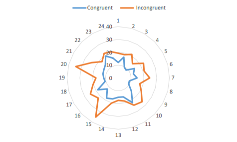

#Project 1: Test a Perceptual Phenomenon
##Background information
In a “Stroop” task, all participants are presented with a list of words, with each word displayed in a color of ink. The participant’s task is to say out loud the color of the ink in which the word is printed. The task has two conditions: a congruent words condition, and an incongruent words condition. In the congruent words condition, the words being displayed are color words whose names match the colors in which they are printed. In the incongruent words condition, the words displayed are color words whose names do not match the colors in which they are printed. In each case, we measure the time it takes to name the ink colors in equally-sized lists. Each participant will go through and record a time from each condition.

**Dataset:** [View CSV](stroopdata.csv)

The dataset can be seen with the link above, and the remainder of this folder contains additional images etc for the project.

##Questions for investigation

####1. What is our independent variable? What is our dependent variable?
**Dependent variable:** Time to name ink colors

**Independent variable:** Condition (congruent/incongruent)

####2. What is an appropriate set of hypotheses for this task? What kind of statistical test do you expect to perform?

**Hypothesis test**

**H<sub>0</sub>:** Time to name colors is the same for congruent and incongruent tasks

**H<sub>A</sub>:** Time to name colors is *not* the same for congruent and incongruent tasks

**Statistical test**

 

The data is roughly normally distributed, with a slight left tail (controversial). I will use a two-tailed dependent t-test because we are comparing two dependent samples of data, which is more reliable in many instances.

####3. Report some descriptive statistics regarding this dataset.

**Congruent**
```
Mean: 14.0
SD: 3.6
```

**Incongruent**
```
Mean: 22.0
SD: 4.8
```

####4. Provide one or two visualizations that show the distribution of the sample data. Write one or two sentences noting what you observe about the plot or plots.

**Completion times of congruent and incongruent tasks**



Congruent tasks appear to be consistently completed faster than incongruent tasks.

####5. What is your confidence level and your critical statistic value? Do you reject the null hypothesis or fail to reject it? Come to a conclusion in terms of the experiment task. Did the results match up with your expectations?
```
µD: -7.9648
S: 4.86482691
df: 23
t-stat: -8.020706944
at α 0.05, t-critical: -2.06865761; 2.06865761
P: 4.103E-08
95% CI: (-25.3527231, 9.42314)
```

**Null hypothesis rejected.** At α 0.05, the *time to name colors is significantly
different* between congruent and incongruent tasks. As made apparent, people do not name colors
at the same speed when the word’s meaning and its color match, as when they
do not match. The result confirms my expectations and provides proof to the experiment.

####6. Optional: What do you think is responsible for the effects observed? Can you think of an alternative or similar task that would result in a similar effect?

The brain has an image association between the shape of the word and the color. When there is a false match or mismatch, additional time is necessary for the prefrontal cortex to process the information and decide on its meaning.

A similar effect would likely be observed if the participants were shown words of the correct color but the wrong text. My thoughts on the matter, however, is that the difference would be less pronounced as I would expect the visual color representation to be more ingrained in the brain that word shape associations.
