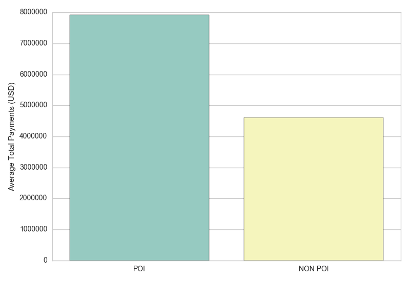
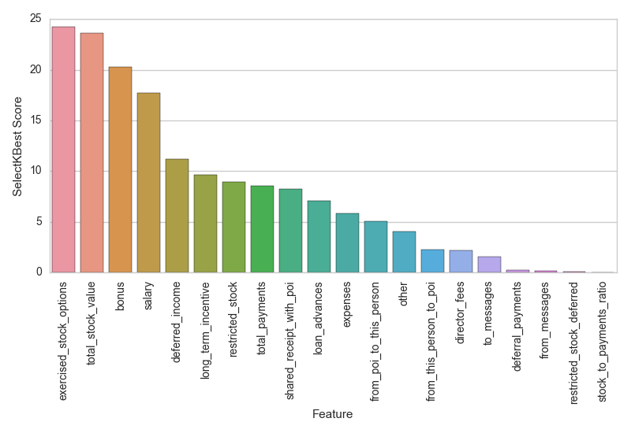
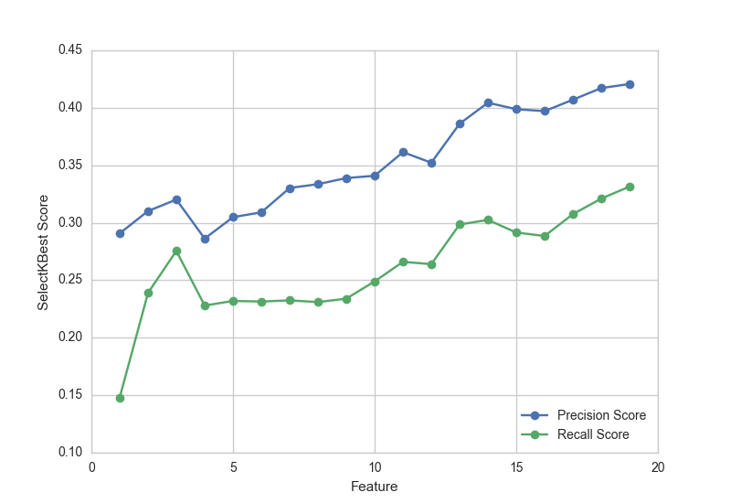
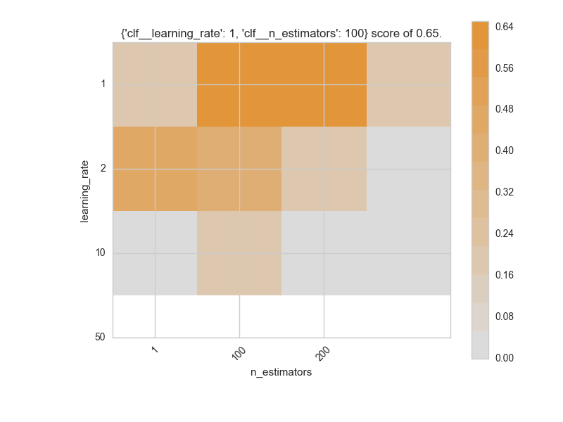

```{r setup, include=FALSE}
knitr::opts_chunk$set(echo = TRUE)
```

## Abstract
In this project I will use machine-learning to build a prediction model that 
will help identify Enron Employees who may have committed fraud based on public 
Enron financial and email data. 


## Background
The Enron Corporation was an American energy, commodities, and services company 
based in Houston, Texas. Before its bankruptcy on December 2, 2001, Enron 
employed approximately 20,000 staff and was one of the world's major 
electricity, natural gas, communications and pulp and paper companies, with 
claimed revenues of nearly $101 billion during 2000.

At the end of 2001, it was revealed that its reported financial condition was 
sustained by institutionalized, systematic, and creatively planned accounting 
fraud, known since as the Enron scandal. Enron has since become a well-known 
example of willful corporate fraud and corruption.

In the email and financial dataset, we have some identified offenders. The goal 
of this project is to build a model to predict other people-of-interest(POI) 
based on the data.


## Analysis
I imported the dataset 'final_project_dataset.pkl' which contains the email
and financial data from former employees of Enron.As part of the exploration, 
here are some questions that were answered by querying the dataset:

| Question | Answer |
| :--- | :---: |
| `How many people are in the dataset?` | `146` |
| `How many POI's are in the dataset?` | `18` |
| `What is the value of stock options exercised by Jeffrey K Skilling?` | `$19,250,000` |
| `How much money did Ken Lay receive in total payments?` | `$103,559,793` |
| `How many folks have a quantified salary (non NaN)?` | `95` |
| `How many folks have a known email address (non NaN)?` | `111` |
| `How many folks have missing information for total_payments?` | `21` |
| `How many POI's have missing information for total_payments?` | `0` |

I added up all the total_payments for POI's and non POI's and divided each by
the number of people in each category. I plotted each average in a barplot form 
to see the two side-by-side.
```{python, eval=FALSE}
### Find total payments by POI's
total_payments_poi = 0
total_payments_non_poi = 0
total_poi = 0
total_non_poi = 0

### Loop through all people in the dataset
for person in temp_data:
    if (person[1]['total_payments'] != 'NaN'):
        if (person[1]['poi']):
            total_payments_poi += person[1]['total_payments']
            total_poi += 1
        else:
            total_payments_non_poi += person[1]['total_payments']
            total_non_poi += 1

### Create a dictionary entry for POI and NON POI averages
total_payments = []
total_payments.append({'POI': 'POI', 
                       'Average_total_payments': total_payments_poi/total_poi})
total_payments.append({'POI': 'NON POI', 
                       'Average_total_payments': total_payments_non_poi/total_non_poi})

# Plot total payments bar plot
total_payments_df = pd.DataFrame(total_payments)
sns.set_style("whitegrid")
ax = sns.barplot(total_payments_df['POI'], 
                 total_payments_df['Average_total_payments'], 
                 palette="Set3")
ax.set(xlabel='', ylabel='Average Total Payments (USD)')
plt.tight_layout()
plt.savefig('total_payments.png')
plt.close()
```


Here we can see the average total payments, which includes salary and bonus 
amounts, is significantly higher (nearly double) for persons-of-interest over 
other employees. The 'total_payments' variable is one of the features I will 
explore and use in the prediction model.


## Outlier Investigation
I removed outliers from the dataset by doing some exploring in 
conjuction with the 'enron61702insiderpay.pdf' spreadsheet. I removed a total of 
5 entries from the dataset including 2 spreadsheet 'total' rows and 3 employee 
entries that had a large number of 'NaN' entries. The 'NaN' entries will be 
converted to zeros in a later step and therefore does not provide algorithm 
training value.
```{python, eval=FALSE}
### Sort the list by salary (highest first)
data_dict = sorted(data_dict.items(), 
            key=lambda item: item[1]['salary'], 
            reverse=True)

### Print the highest 3 salaries in the list (exclude 'NaN' values)
count = 0
print "People with highest salaries:"
for person in data_dict:
    if person[1]['salary'] != 'NaN' and count <= 2:
        print person[0]
        count += 1

### Print names of people with 'NaN' values many of the features
count = 0
print "People with 18 or more NaN values:"
for person in data_dict:
    for feature in person[1]:
        if person[1][feature] == 'NaN':
            count += 1
    if count >= 18:
        print person[0]
    count = 0
```
```
People with highest salaries:
   TOTAL                            $26,704,229
   SKILLING JEFFREY K               $1,111,258
   LAY KENNETH L                    $1,072,321
   
People with 18 or more NaN values:
   WHALEY DAVID A                   18 NaN values
   WROBEL BRUCE                     18 NaN values
   LOCKHART EUGENE E                20 NaN values
   THE TRAVEL AGENCY IN THE PARK    18 NaN values
   GRAMM WENDY L                    18 NaN values
```
Looking at the output, we can see "TOTAL" and "THE TRAVEL AGENCY IN THE PARK" 
shouldn't be in the dataset because these are spreadsheet artifacts. Looking 
at the employees with high 'NaN' counts more closely, I made a call to keep 
GRAMM in the dataset since there were some entries with valuable fields.


## Create Feature List
Next, I created a list of features for building my person-of-interest identifier.
I have included a large number of features in the list, both financial and email
features, since I am uncertain which are the most important at this time. I 
will perform a feature ranking on the features list to see which are the most 
useful.

| Features |
| --- |
| `poi` |
| `salary` |
| `deferral_payments` |
| `total_payments` |
| `loan_advances` |
| `bonus` |
| `restricted_stock_deferred` |
| `deferred_income` |
| `total_stock_value` |
| `expenses` |
| `exercised_stock_options` |
| `other` |
| `long_term_incentive` |
| `restricted_stock` |
| `director_fees` |
| `to_messages` |
| `from_poi_to_this_person` |
| `from_messages` |
| `from_this_person_to_poi` |
| `shared_receipt_with_poi` |


## Choose Algorithm
In this situation we have labeled data, meaning we have some POI's identified
already and will serve as a training set for training a classification algorithm.
The types of algorithms best used with labeled data are called "Supervised" 
algorithms and I've chosen a few to test, as well as a couple of "ensemble 
methods." The goal of ensemble methods is to combine the predictions of several 
base estimators built with a given learning algorithm in order to improve 
generalizability / robustness over a single estimator.

| Algorithm | Class |
| --- | --- |
| Decision Tree | `sklearn.tree.DecisionTreeClassifier` |
| Naive Bayes | `sklearn.naive_bayes.GaussianNB` |
| Logistic Regression | `sklearn.linear_model.LogisticRegression` |
| Random Forest | `sklearn.ensemble.RandomForestClassifier` |
| AdaBoost | `sklearn.ensemble.AdaBoostClassifier` |
| Support Vector Classification | `sklearn.svm.SVC` |

I tested each estimator using the default parameters and looked at the 
precision and recall scores.
```{}
            Classifier  precision  recall
0  Logistic Regression  0.173486  0.1590
1          Naive Bayes  0.213665  0.4300
2        Random Forest  0.404475  0.1175
3             AdaBoost  0.361329  0.2990  <<-- Highest Scores
4        Decision Tree  0.220356  0.2230
```
The results show that AdaBoost has the highest combined precision and recall 
score and nearly meets the target values for the project. I'll choose this
classifier going forward and fine tune the parameters.

Precision and Recall are metrics used to evaluate classifier output quality. The
difference between the two is that precision is a measure of result relevancy, 
while recall is a measure of how many truly relevant results are returned. High
scores for both show the classifier is able to predict accurate results and a
majority of poisitve results.

| Score | Formula |
| --- | --- |
| Accuracy | `(Σ True positive + Σ True negative) / Σ Total population` |
| Precision | `Σ True positive / (Σ True positive + Σ False positive)` | 
| Recall | `Σ True positive / (Σ True positive + Σ False negative)` |

In the specific case of building a person-of-interest classifier, the precision 
is the ability of the classifier not to identify a person as a POI incorrectly 
(maximum precision = no false positives), and "recall" is the ability of the 
classifier to correctly find all the POI's (maximum recall = no false negatives).

Accuracy of the model can be defined as the proportion of POI's and Non-POI's 
correctly. However, accuracy is not a good score in this case since the dataset 
in this project is small and the ratio of negatives to positives is highly 
skewed (18 POI's out of 146 total cases). I will focus on the precision and 
recall scores to evaluate the performance of the model going forward.

## Create New Features
The First step to help improve the classifier is to add new features that may help
classifying the data. I used intuition and a bit of investigation to form these
new features. I will need to test the effectiveness of each of these features 
to determine if they are worth keeping in the list.

***Feature 1:*** 'stock_to_payments_ratio'<br>
I noticed that the POI's had very large stock values relative to their total 
payments value. This feature is the ratio of total stock value to 
total payments.

***Feature 2:*** 'poi_to_total_emails_sent_ratio' <br>
I think POI's would be more likely to <b>send</b> a large portion of emails to 
other POI's. This feature is a ratio of emails sent to POI's to total emails 
sent.

***Feature 3:*** 'poi_to_total_emails_received_ratio' <br>
I think POI's would be more likely to <b>receive</b> a large portion of emails 
to other POI's. This feature is a ratio of emails received from POI's to total 
emails received.

| New Features | Formula |
| --- | --- |
| `stock_to_payments_ratio` | `( total_stock_value / total_payments )` |
| `poi_to_total_emails_sent_ratio` | `( from_this_person_to_poi / to_messages )` |
| `poi_to_total_emails_received_ratio` | `( from_poi_to_this_person / from_messages )` |

In order to test the effectiveness of each of the new features, I first
calculated a baseline precision and recall score without the newly created 
features for comparison. Then, I added the new features to the list individually
and recalculated the precision and recall scores and compared them to the 
baseline score. 

```{}
Testing New Features using AdaBoostClassifier

Baseline Scores (without new features):
  features  : 20 
  recall    : 0.30
  precision : 0.39
  
Scores with 'stock_to_payments_ratio' feature:  
  features  : 21
  recall    : 0.32
  precision : 0.42
  
Scores with 'poi_to_total_emails_sent_ratio' feature: 
  features  : 21
  recall    : 0.29
  precision : 0.35
  
Scores with 'poi_to_total_emails_received_ratio' feature: 
  features  : 21
  recall    : 0.29
  precision : 0.37
```
We can see the 'stock_to_payments_ratio' feature improved the precision and 
recall scores when added to the list, so I will keep this feature moving
forward. The other two new features did not improve the precision and recall 
scores so I'll leave these new features out.

## Feature Selection
Next I'll evaluate the rest of the features and see if any can be removed. I 
explored different feature selection techniques including Univariate feature
selection and Recursive Feature Elimination. In univariate feature selection 
each feature is considered separately, thereby ignoring feature dependencies. 
The recursive feature elimination technique recursively considers smaller and 
smaller sets of features and each feature is ranked by importance. First I 
performed Recursive feature elimination on the features and examined the ranking.
```{}
# Recursive Feature Elimination
# rfe = RFE( clf, n_features_to_select = 1 )
# rfe.fit( features, labels )
|----------------------------------|
| Rank | Feature                   |
|----------------------------------|
| 1    | other                     |
| 2    | expenses                  |
| 3    | deferred_income           |
| 4    | exercised_stock_options   | 
| 5    | from_this_person_to_poi   |
| 6    | stock_to_payments_ratio   |
| 7    | salary                    |
| 8    | bonus                     |
| 9    | to_messages               |
| 10   | restricted_stock          |
| 11   | shared_receipt_with_poi   |
| 12   | long_term_incentive       |
| 13   | from_poi_to_this_person   |
| 14   | total_stock_value         |
| 15   | director_fees             |
| 16   | restricted_stock_deferred |
| 17   | from_messages             |
| 18   | loan_advances             |
| 19   | total_payments            |
| 20   | deferral_payments         |
|----------------------------------|
```
The results show that the top ranked feature is the 'other' feature, which is
surprising. I expected stock or salary features to be at the top. I am also 
surprised that the 'total_payments' feature is second-to-last in the ranking. 
With these unexpected items, I'll get a second opinion by using a univariate 
approach. I'll use SelectKBest to score each of the features.

```{}
# Univariate Feature Selection using SelectKBest
# selectbest = SelectKBest( k = 'all' )
# selector   = selectbest.fit( features, labels )
|------------------------------------------------|
| Feature                            | Score     |
|------------------------------------------------|
| exercised_stock_options            | 24.261749 |
| total_stock_value                  | 23.621774 |
| bonus                              | 20.257185 |
| salary                             | 17.717874 |
| deferred_income                    | 11.184580 |
| long_term_incentive                | 9.622212  |
| restricted_stock                   | 8.945503  |
| total_payments                     | 8.570823  |
| shared_receipt_with_poi            | 8.276138  |
| loan_advances                      | 7.066711  |
| expenses                           | 5.815328  |
| from_poi_to_this_person            | 5.041257  |
| other                              | 4.070343  |
| from_this_person_to_poi            | 2.295183  |
| director_fees                      | 2.164684  |
| to_messages                        | 1.542581  |
| deferral_payments                  | 0.240335  |
| from_messages                      | 0.181215  |
| restricted_stock_deferred          | 0.066555  |
| stock_to_payments_ratio            | 0.024446  |
|------------------------------------------------|
```


I plotted the SelectKBest score results in a bar plot and we can see that
the stock and salary features received the top scores. The new feature that I 
added 'stock_to_payments_ratio' got the lowest score. Next I'll look at the
precision and recall scores using SelectKBest features to see how many features
should be selected moving forward.

```{}
# Pipeline SelectKBest -> Classifier for classifier scoring
# pipeline = Pipeline(steps=[("sel", SelectKBest(k=index)),
#                            ("clf", AdaBoostClassifier())])
|-------------------------------|
| Features | Precision | Recall |
|-------------------------------|
| 1        | 0.290766  | 0.1480 |
| 2        | 0.312943  | 0.2430 |
| 3        | 0.321202  | 0.2780 |
| 4        | 0.285354  | 0.2260 |
| 5        | 0.304005  | 0.2315 |
| 6        | 0.311421  | 0.2345 |
| 7        | 0.331687  | 0.2350 |
| 8        | 0.333815  | 0.2310 |
| 9        | 0.335498  | 0.2325 |
| 10       | 0.339959  | 0.2480 |
| 11       | 0.362652  | 0.2680 |
| 12       | 0.351839  | 0.2630 |
| 13       | 0.386158  | 0.2985 |
| 14       | 0.405333  | 0.3040 |
| 15       | 0.396978  | 0.2890 |
| 16       | 0.406353  | 0.2900 |
| 17       | 0.407015  | 0.3070 |
| 18       | 0.418770  | 0.3235 |
| 19       | 0.420685  | 0.3315 | <<-- HIGHEST SCORES
|-------------------------------|
```


Looking at the output and the chart of the precision and recall scores, we can
see that the highest scores are obtained by using the full feature set. I'll 
use all the features going forward.

## Feature Scaling
In the dataset we have many different features with different variable units. 
Some features represent the number of emails, others are amounts of money, and 
some are ratios of different values. Feature scaling is a method used to 
standardize the features of data and allow for the classification algorithms to
more accurately analyze each feature. I used the MinMaxScaler which transforms
features by scaling each feature to a range between 0 and 1. 
```{python, eval=FALSE}
# Create an instance of the min_max_scaler
min_max_scaler = preprocessing.MinMaxScaler()

# Fit and Transform the feature set
min_max_scaler.fit_transform(features)
```

## Cross Validation
Supervised machine learning is best understood as approximating a target 
function (f) that maps input variables (X) to an output variable (Y).

Y = f(X)

It is important to test how well the model is mapping the input variables to
output variables. If we train and test the model using a single dataset, we 
are susceptable to a common issue called 'overfitting.' In this common issue,
the model fits to the training data too well and does a poor job when introduced
to new data. 

In order to limit overfitting and accurately gauge model performance, it is 
important to partition the data into independent training and validation 
datasets. The training set is used to fit the models and the validation set is 
used to estimate model performance.

I used the Stratified ShuffleSplit cross-validator to split the data into 
randomized train/test sets. I also specified a large number of folds to the 
cross-validator and averaged the scores to get more accurate results.
```{python, eval=FALSE}
def get_classifier_scores(clf, my_dataset, features_list, folds=1000):

    ### Format the Data
    data = featureFormat(my_dataset, features_list, sort_keys=True)
    
    ### Separate the labels and features
    labels, features = targetFeatureSplit(data)
    
    ### Create the cross-validator
    cv = StratifiedShuffleSplit(labels, folds, random_state = 42)
```

## Tune Algorithm
To further ensure that the model does not overfit the data and to optimize the 
algorithm performance, I'll need to tune the algorithm parameters. I use a grid
search parameter sweep, which is an exhaustive search through a manually 
specified subset of parameter values. The grid search will be evaluated using
a custom defined function that maximized the precision and recall scores. The
grid search will return the best parameters to optimize the algorithm. 

I want to test a range of SelectKBest values in addition to the AdaBoost 
classifier parameters so I'll use a Pipeline to combine both into a single 
classifier.

```{python, eval=FALSE}
### Pipeline SelectKBest and AdaBoost
clf = Pipeline(steps=[("sel", SelectKBest()),
                      ("clf", AdaBoostClassifier())])
```

#### Grid Search
Next I'll setup the grid search using a manually defined parameter range. In the
interest of reasonable computing time I'll narrow the parameter search to low, 
medium, and high values for each of the parameters.

```{python, eval=FALSE}
### Set the parameter ranges
params = [{'sel__k': [4, 16, 'all'],
           'clf__n_estimators': [1, 100],
           'clf__learning_rate': [1, 10, 50],
           'clf__algorithm': ['SAMME', 'SAMME.R']}]

### Setup a cross validation object
cv = StratifiedShuffleSplit(labels, 100, random_state=42)

### Create the custom scorer function
custom_scorer = make_scorer(custom_score, greater_is_better=True)

### Grid search for tuning the classifier
grid = GridSearchCV(estimator=clf, param_grid=params, cv=cv, scoring=custom_scorer)

### Fit the grid to the training set
grid.fit(features, labels)
```
I created a custom scorer function to meet the project requirements of acheiving
a precision and recall score higher than 0.3.
```{python, eval=FALSE}
def custom_score(y, y_pred):

    ### Calculate the Precision Score
    precision = precision_score(y, y_pred)

    ### Calculate the Recall Score
    recall = recall_score(y, y_pred)

    ### Return the total precision and recall score only if both over threshold
    if precision >= 0.3 and recall >= 0.3:
        return (precision + recall)
    else:
        return 0
```
After running the grid search, the best parameters were printed out.
```{}
Best parameters set found on development set:
'clf__learning_rate': 1
'sel__k': 16
'clf__algorithm': 'SAMME.R'
'clf__n_estimators': 100
```

#### Visual Grid Search
I was curious about the following two AdaBoost parameters: 'learning_rate' and 
'n_estimators' and their effect on the grid search scores. I did another grid 
search on these two parameters with larger ranges and plotted a heat map to 
look at the relationship.

```{python, eval=FALSE}
def visual_gridsearch(model, X, y):

    ### Colors used in the heat map
    ddl_heat = ['#DBDBDB', '#DCD5CC', '#DCCEBE', '#DDC8AF', '#DEC2A0', '#DEBB91', \
                '#DFB583', '#DFAE74', '#E0A865', '#E1A256', '#E19B48', '#E29539']
    ddlheatmap = colors.ListedColormap(ddl_heat)

    ### Define the parameter value ranges
    n_estimator_range = [1, 100, 200]
    learning_rate_range = [1, 2, 10, 50]

    ### Combine the parameters into a dictionary
    param_grid = dict(clf__n_estimators = n_estimator_range,
                      clf__learning_rate = learning_rate_range)

    ### Setup a cross validation object
    cv = StratifiedShuffleSplit(y, 100, random_state=42)

    ### Setup the classifier using the provided model
    clf = Pipeline(steps=[("sel", SelectKBest(k=16)),
                          ("clf", model)])

    ### Create the custom scorer function
    custom_scorer = make_scorer(custom_score, greater_is_better=True)

    ### Create the grid and fit the classifier
    grid = GridSearchCV(clf, param_grid = param_grid, cv=cv, scoring=custom_scorer)
    grid.fit(X, y)

    ### Get the grid scores after fitted
    scores = grid.cv_results_['mean_test_score']
    scores = np.array(scores).reshape(len(n_estimator_range), len(learning_rate_range))

    ### Plot the heatmap
    plt.figure(figsize=(8, 6))
    plt.subplots_adjust(left=.2, right=0.95, bottom=0.15, top=0.95)
    plt.imshow(scores, interpolation='nearest', cmap=ddlheatmap)
    plt.xlabel('n_estimators')
    plt.ylabel('learning_rate')
    plt.colorbar()
    plt.xticks(np.arange(len(n_estimator_range)), n_estimator_range, rotation=45)
    plt.yticks(np.arange(len(learning_rate_range)), learning_rate_range)
    plt.title(
        "{} score of {:0.2f}.".format(grid.best_params_, grid.best_score_)
    )

    ### Store the figure
    plt.savefig('visual_grid_search.png')
    plt.close()

    print "Visual GridSearch created"
    print "..."

    return
```


The plot shows the maximized values for each of the parameters is reached 
with a 'learning_rate' of 1 and 'n_estimators' set to 100. The dark orange
indicates similar results with higher values of 'n_estimators' but higher 
values for this parameter consume more computing resources.

## Algorithm Performance
Finally, I took the GridSearchCV parameter values and put them into the 
AdaBoost classifier. I used a pipeline to package the SelectKBest feature
selector along with the classifier to have the combination sent to the tester.
```{python, eval=FALSE}
### Pipeline the MinMaxScaler since the test_classifier repartitions the non-scaled data
clf = Pipeline(steps=[("sel", 
                       SelectKBest(
                         k=params['sel__k'])),
                      ("clf", 
                       AdaBoostClassifier(
                         n_estimators=params['clf__n_estimators'],
                         learning_rate=params['clf__learning_rate'],
                         algorithm=params['clf__algorithm']))])

### Check the results using the test_classifier task
test_classifier(clf, my_dataset, features_list)
```
```
Accuracy          : 0.85620	
Precision         : 0.44324	
Recall            : 0.30650	
F1                : 0.36240	
F2                : 0.32665
Total predictions : 15000	
True positives    : 613	
False positives   : 770	
False negatives   : 1387	
True negatives    : 12230
```
The output shows that the Logistic Regression classifier was able to acheive
a 0.86 accuracy score, 0.44 precision score, and 0.31 recall score. The Scores 
show that we meet the threshold of project requirements with a precision and 
recall score higher than 0.3.

| ***Resources*** |
| --- |
| `https://en.wikipedia.org/wiki/Enron_scandal` |
| `http://scikit-learn.org/stable/modules/generated/sklearn.feature_selection.RFE.html` |
| `http://scikit-learn.org/stable/modules/generated/sklearn.preprocessing.MinMaxScaler.html` |
| `https://www.quora.com/What-is-the-difference-between-supervised-and-unsupervised-learning-algorithms` |
| `http://scikit-learn.org/stable/modules/generated/sklearn.metrics.precision_recall_curve.html` |
| `http://scikit-learn.org/stable/modules/generated/sklearn.linear_model.LogisticRegression.html` |
| `http://acartoonist.com/enron.jpg` |
| `http://blog.districtdatalabs.com/visual-diagnostics-for-more-informed-machine-learning-part-3` |
| `http://scikit-learn.org/stable/tutorial/machine_learning_map` |
| `https://en.wikipedia.org/wiki/Hyperparameter_optimization` |


