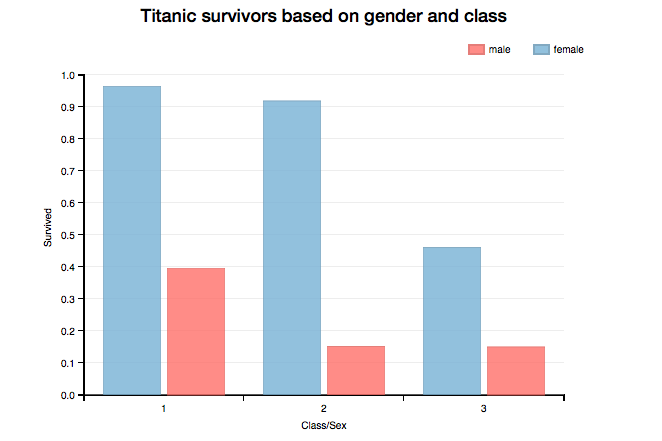
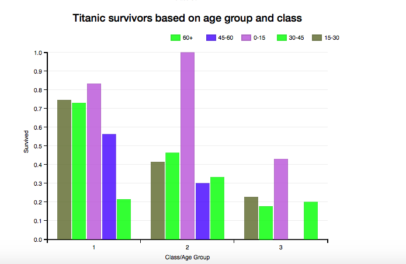
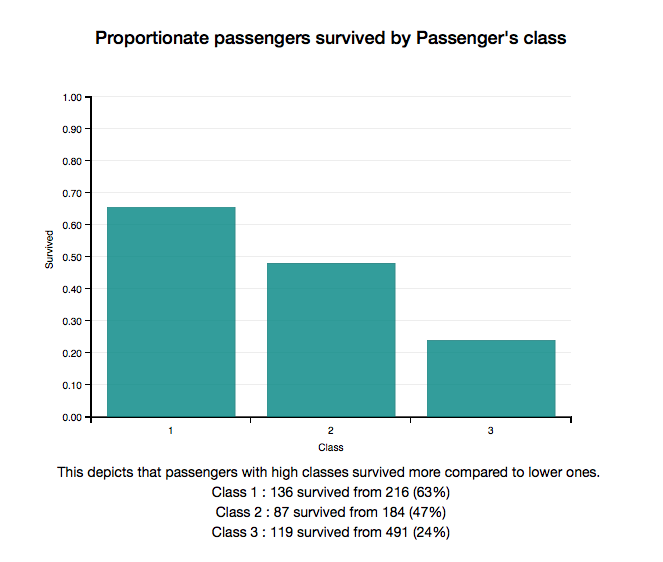
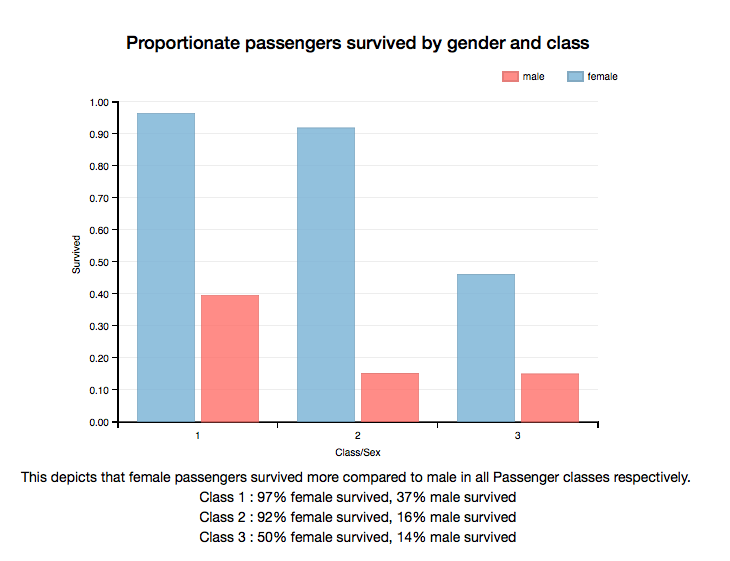
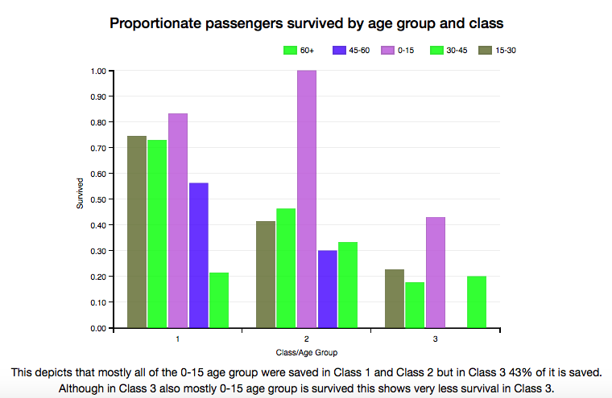

## Analysis of passengers, focusing on classes, age and more onboard the Titanic by James Gallagher

### Summary

Contains demographics and passenger information from 891 of the 2224 passengers and crew on board the Titanic. survival : Survival (0 = No; 1 = Yes) class : Passenger Class (1 = 1st; 2 = 2nd; 3 = 3rd)

### Design

####  Data Analysis and Cleaning (Pandas)

I have already investigated the titanic dataset earlier in project 2 using pandas so from that I found that Age field has some null values which I cleaned it by replacing null values of Age with N/A field and distributed Age in group of 15 for better visualisation further.

#### Data Visualization (dimple.js)

I chose to work with **dimple.js** as it would be sufficient and effective for this task:

Since I have a set comparative data that I would like to represent through a chart then a bar chart would be the best option. This type of chart is one of the more familiar options as it is easy to interpret. These charts are useful for displaying data that is classified into nominal or ordinal categories. 

Initial visualisations:

This visualization depicts that in all type of passenger classes female gender survived more than males, in Class1 and Class 2 more than 90% of females were survived.

This visualization depicts that in mostly young age group survived and children b/w 0-15 were saved first.

### Pre-interview Analysis

Interview #1

Your chart was a bit less informative as survival ratio just shows upto one decimal place. It should be atleast upto two decimal places. Also try to order your x part properly arranged in numerical sequence order. The insights is not so much of a surprise and if you just create a small tweak in the legend, x-axis & y-axis then this would looks good....

Interview #2

The chart is interactive, that's nice. But why the class is ordered as 1,3,2 in both the charts try to order the x-axis and I think the chart will look much better. Broadly speaking, the chart looks intuitive & only needs a few small tweaks. Nice work!!!

Interview #3

The overall representation is good. You should also show visualization just on the basis of survival rate with class as it appears to be the most correlated feature with survival rate.. Also try to use sequential colour pallete in visualization 2.

### Post-change Visualizations

Following my personal reflection, I implemented the following changes:

- I made an extra chart just representing survival rate across different Passenger Classes.
- I ordered the x-axis in proper sequence of Passenger class using addOrderRule function.
- I showed survival proportions up to 2 decimal places using tickFormat function.
- Made visualizations more explanatory with proper description and formatting.

Final visualizations of the data visualization is shown below:

### Results

- Visualizations depicts that high class passengers were able to survive more. Survival rate
- Female gender survived more than male gender and in all classes.
- Most of the passengers of age b/w 0-15 were survived.
- From above inferences we conclude that children and females were first saved ordered by their passenger class.

### References

- [dimple.js Documentation](http://dimplejs.org/)
- [Data Visualization and D3.js (Udacity)](https://www.udacity.com/course/viewer#!/c-ud507-nd)
- [Dimple homepage](http://dimplejs.org/examples_viewer.html?id=bars_vertical_grouped)
